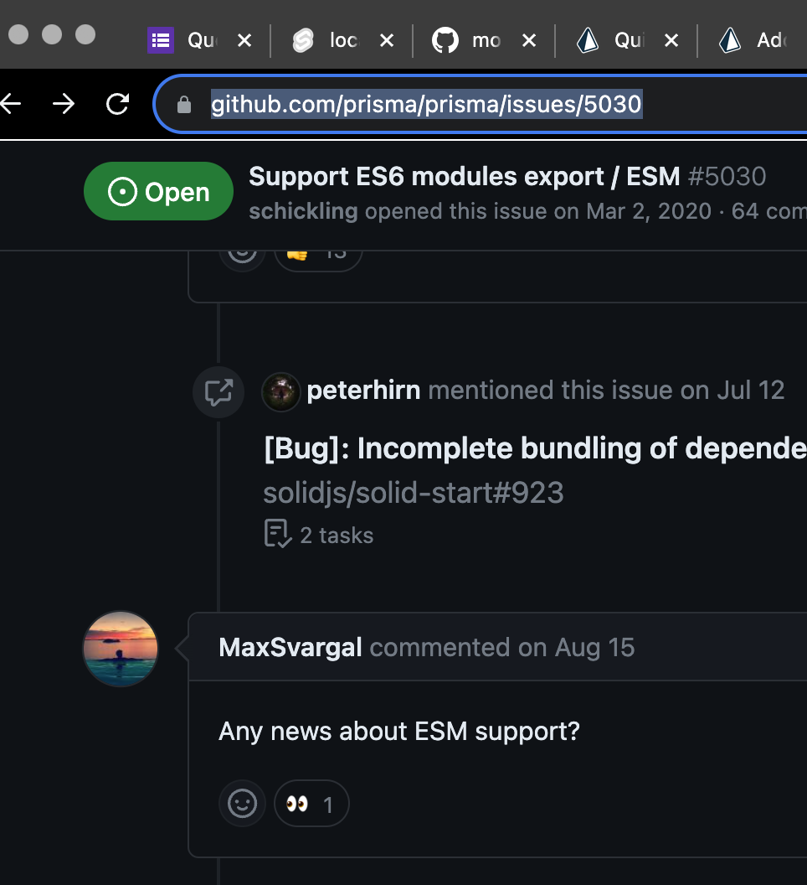

# Research & References

[testing](https://svelte.dev/docs/faq#how-do-i-document-my-components)

[Typescript and JSDocs](https://blog.robino.dev/posts/doc-comments-svelte#types)
[and](https://svelte.dev/docs/typescript)
[and](https://medium.com/@trukrs/type-safe-javascript-with-jsdoc-7a2a63209b76)

[Prisma, SQLite and SvelteKit](https://www.prisma.io/blog/sveltekit-prisma-kvCOEoeQlC)
[and this repo example](https://github.com/prisma/prisma-examples/tree/latest/typescript/sveltekit)

[Prisma not quite supporting ES6](https://github.com/prisma/prisma/issues/5030)
[and](https://stackoverflow.com/questions/66738563/error-importing-prismaclient-in-code-compiled-from-typescript-syntaxerror-name)

[Svelte form references](https://learn.svelte.dev/tutorial/select-bindings)
